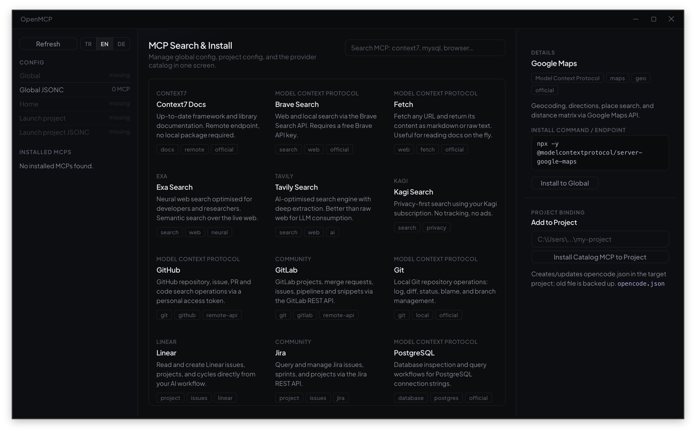

# OpenMCP



OpenMCP is a clean desktop app and CLI tool for managing OpenCode MCP servers from one place. It lets you view installed MCPs, enable or disable them, remove them safely, and add new MCPs from a curated catalog.

## What It Does

- Lists MCP entries from OpenCode config files.
- Enables or disables MCP servers with one click.
- Creates a `.bak-<timestamp>` backup before removing entries.
- Installs ready-to-use MCP definitions such as Context7, Playwright, GitHub, PostgreSQL, MySQL, and filesystem.
- Copies global MCPs into a selected project or creates a new project-specific MCP entry.
- Keeps sensitive environment values hidden and only displays environment key names.

## Usage

```bash
npm install
npm run tauri dev
```

Use the CLI with:

```bash
npm run cli -- list
npm run cli -- install context7
npm run cli -- disable context7
```

## Build

```bash
npm run build
npm run tauri build -- --no-bundle
```

When changes are pushed to the `main` branch, GitHub Actions builds the app for Linux, macOS, and Windows, then publishes the packaged outputs as an automatic prerelease in GitHub Releases.
